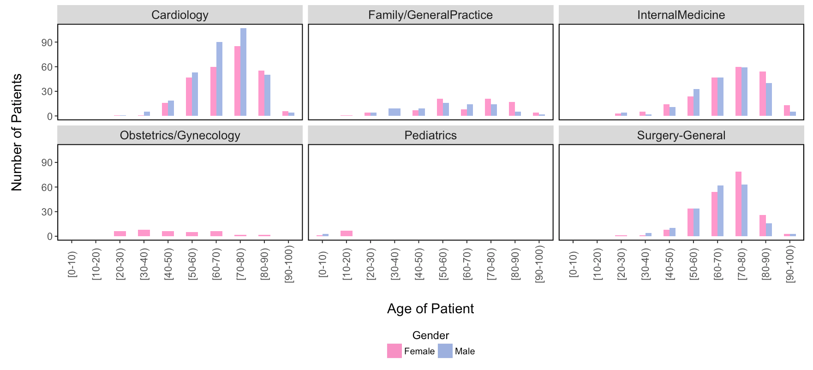

# Visualization-Diabetes

This is a visualization of diabetic patient hospital visits in the US. I used the R Shiny libraries to make an interactive web application to explore some of the data. 

The data is from 130 US hospitals between 1999 - 2008. It contains basic patient information (e.g. height, weight, gender, age) as well as information regarding the hospital visit, including: physician specialty, the number of days the patient was admitted, and the number of procedures performed on the patient. 

There is a bubble plot that describes the number of medications prescribed to a patient vs. the number of laboratory procedures performed: 

 

A parallel coordinates plot that summarizes the patient/hospital interaction for each medical specialty:

 

As well as a collection of bar plots which describe the patient demographics that each medical specialty encountered:

 

To run the web app, from the R console type:

shiny::runGitHub('Visualization-Diabetes', 'emchinn')
